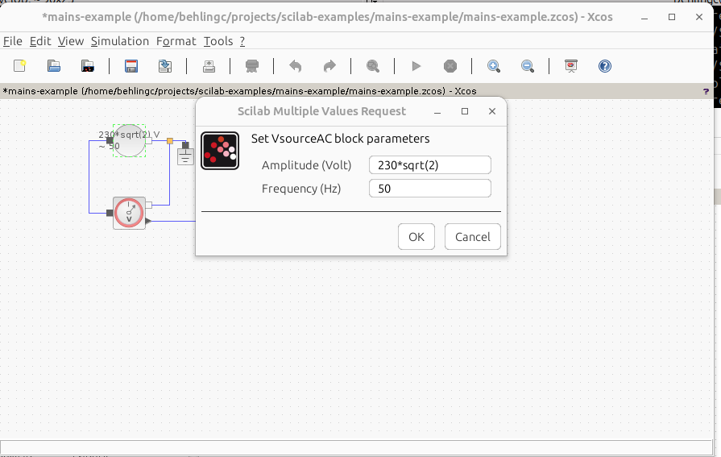

# Mains Example

Created with [Scilab/Xcos 20024.0.0](https://www.scilab.org/download/2024.0.0/scilab-2024.0.0.bin.x86_64-linux-gnu.tar.xz) on Ubuntu 23.04.


## Scope

This example demonstrates how to model a German 230V/50Hz mains voltage supply.

A scope shows one period of the sine wave. 


## Creation Steps

Start Scilab from the Linux console:

```
MESA_GL_VERSION_OVERRIDE=3.0 ~/scilab-2024.0.0/bin/scilab
```

In the scilab console type ***xcos*** to start Xcos:


```
xcos
```

Drag these ***Electrical*** blocks onto the canvas:


Drag the ***CLOCK_C*** block from ***Sources*** onto the canvas:


Drag the ***CSCOPE*** block from ***Sinks*** onto the canvas:


Link everything:


Change the ***Amplitude*** parameter from the ***VSourceAC*** block to ***230\*sqrt(2)*** Volts, since this is the Amplitude for the RMS voltage of 230V:



Change the ***Period*** from the ***CLOCK_c*** block to ***0.001*** Seconds
(1 Millisecond) to have a good resolution of the 50 Hz (20 Millisecond) period of the
sine wave. Further, set the ***Initialisation time*** to ***0*** Seconds since we want to see the the wave from second 0 on:


For the CSCOPE block set ***Ymin*** to ***-350*** Volts and ***Ymax*** to ***350***
Volts to see the maximum amplitude. Further set ***Refrensh Period*** to ***0.02***
Seconds (20 Milliseconds) to just show the 50 Hz (20 Millisecond) period.


Finally, select ***Simulation->Setup*** and set the final integration time also to
20 Milliseconds since we just want to simulate the first sine wave:


Run the simulation by pressing the ***Start*** button:


