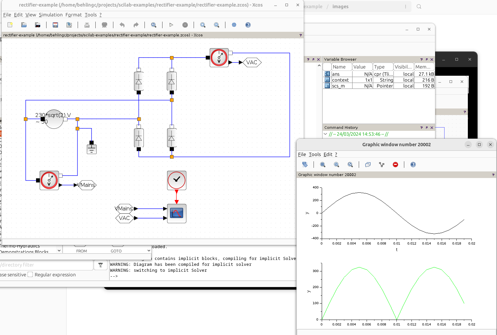

# Rectifier Example

Created with [Scilab/Xcos 20024.0.0](https://www.scilab.org/download/2024.0.0/scilab-2024.0.0.bin.x86_64-linux-gnu.tar.xz) on Ubuntu 23.04.

## Scope

This example demonstrates how to model a recifier without load at a German 230V/50Hz
mains voltage supply.

One scope shows one period of the mains sine wave.

Another scope shows the recified voltage. 

## Creation Steps

Create the mains suppy the same way as done in the [Mains Example](../mains-example/README.md).

Add a rectifier as shown above using the ***Diode*** block from ***Electrical** with
an additional voltage measurement with ***Ymin*** ***0*** Volt and ***Ymax*** ***350*** Volt.

Link everything as shown above.

Run the simulation with the same ***Final integration time*** of 20 Millisconds.

